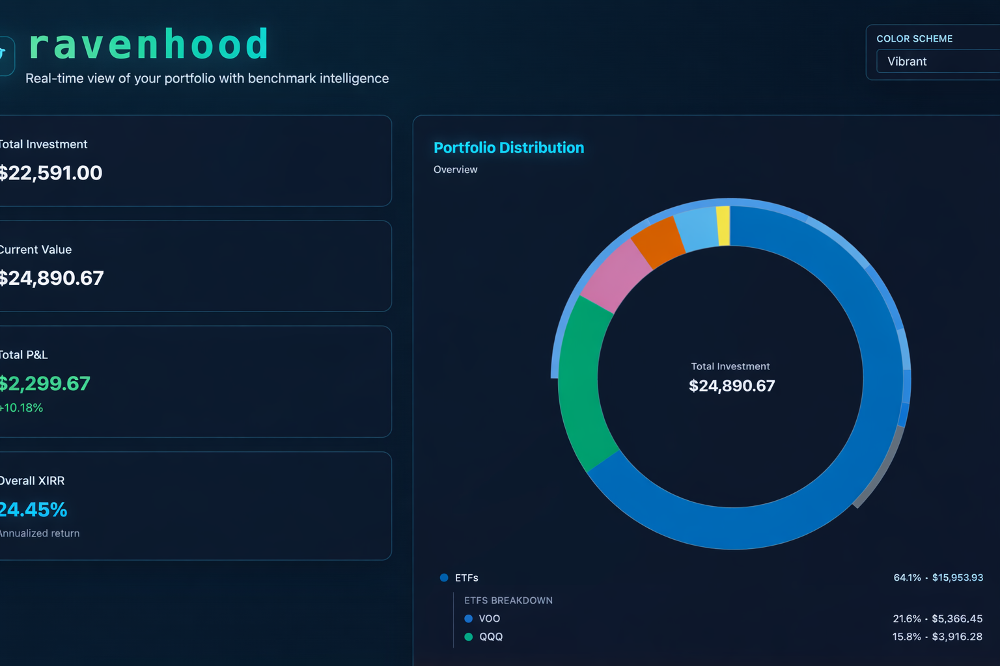

# Ravenhood



---

Ravenhood is a better Robinhood analytics dashboard that is local-first. It pairs a Flask backend with a modern single-page frontend to show portfolio performance, holdings, benchmark comparisons, and cash-flow insights.

## What It Does

- Authenticates with Robinhood credentials (including optional 2FA code support).
- Fetches stock holdings and transaction history.
- Computes per-holding and portfolio-level metrics including P/L and XIRR.
- Compares portfolio behavior with an S&P 500 strategy.
- Visualizes allocation, performance trends, and monthly cash flows.
- Shows holding-level metadata such as sector and ETF classification.

## Tech Stack

- Backend: Python, Flask, robin-stocks, yfinance, pyxirr, pandas
- Frontend: HTML, Tailwind CSS (CDN), Chart.js, Font Awesome
- Runtime model: Local server (`http://localhost:5005`) serving API + UI

## Project Structure

- `backend.py`: Flask API server, Robinhood login flow, portfolio calculations, and analytics endpoints.
- `index.html`: Single-page dashboard UI with login, charts, and holdings table.
- `palettes.ts` / `palettes.js`: Color palette definitions for dashboard theme options.
- `requirements.txt`: Python dependencies.

## API Overview

- `POST /api/login`
  - Body: `username`, `password`, optional `mfa_code` / `mfaCode`
  - Response indicates success or whether additional authentication is required.
- `GET /api/portfolio`
  - Returns consolidated portfolio data: stocks, S&P 500 comparison, historical performance, and cash flow data.
- `POST /api/logout`
  - Logs out and clears backend login state.

## Getting Started

### 1. Prerequisites

- Python 3.10+
- A Robinhood account

### 2. Install dependencies

```bash
python3 -m venv .venv
source .venv/bin/activate
pip install -r requirements.txt
```

### 3. Run the app

```bash
python backend.py
```

Then open [http://localhost:5005](http://localhost:5005).

## How Login Works

1. Enter Robinhood username and password in the Ravenhood login screen.
2. If Robinhood requests additional verification, enter your code in the optional `2FA Code` field.
3. Ravenhood sends credentials only to your local Flask backend.

## Notes and Caveats

- This project is intended for local/personal use.
- Broker APIs and response formats can change over time.
- Some computed historical data is approximation-based and depends on available transaction + market data.

## Security Considerations

- Run Ravenhood only on trusted machines.
- Avoid exposing port `5005` to public networks.
- Treat Robinhood credentials and session data as sensitive.

## Roadmap Ideas

- Add persistent local config and encrypted credential/session handling.
- Improve historical portfolio valuation accuracy by reconstructing point-in-time holdings.
- Add export support (CSV/PDF) for reports.
- Add tests for API response contracts and core analytics logic.

## License

This project is licensed under the Apache 2.0 License. See `LICENSE` for details.
